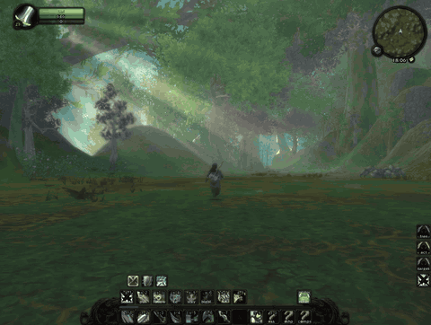

# comfyatmosphere

> **Very early alpha.** This has only been tested on one computer -- mine -- with one 1.12 client
> build (VanillaFixes + DXVK). It hooks deep into the game's rendering. Expect bugs, back up your client
> folder first, and if anything goes wrong just remove the `comfyfog.dll` line from `dlls.txt`.

Atmosphere for the World of Warcraft 1.12 client: thicker, moodier fog, sun rays, and volumetric light
that glows through the trees. One DLL and one ini file -- `comfyfog.dll` and
`comfyfog.ini`, named for where it started -- tuned live in game.

[](media/comfyatmosphere.mp4)

*Click the preview for the full video.*

It is a sibling of comfygrass (swaying grass for the same client) and loads the same way: through VanillaFixes, patching the
Direct3D 9 device of the DXVK `d3d9.dll` the client runs on.

## Features

| | What it does | Default |
| --- | --- | --- |
| **Fog** | One 0–100 `thickness` dial: a haze close to the camera and a gentler build into the distance. Trees and characters fog with the terrain. | on |
| **Sun rays** | Screen-space shafts streaming from the sun (the one drawn in the sky), before the UI so the action bars get none. | on |
| **Volumetric light** | The fog lit where sunlight reaches it and dark where leaves and walls shade it, fixed in the world as you move the camera. Needs `[depth]` and `[shadow]`. | off |
| **Clouds** | `[sky] clouds = 0` hides the cloud layer. | shown |

Everything is in `comfyfog.ini`, and **F11 reloads it in game**, so every value can be tuned live.

## Keys

| Key | |
| --- | --- |
| F11 | Reload `comfyfog.ini` |
| Shift+F11 | Fog on / off (for a before / after look) |
| Ctrl+F11 | Sun rays on / off |
| Alt+F11 | Volumetric light on / off |
| F12 | Log one frame of diagnostics to `comfyfog.log` |

## Install

Download the zip from [Releases](https://github.com/aloofbit/comfyatmosphere/releases), or build it yourself
(below).

1. Copy `comfyfog.dll` and `comfyfog.ini` into the client folder, next to `WoW.exe` and `d3d9.dll`.
2. Add a line `comfyfog.dll` to `dlls.txt`. If you also use comfygrass, put it **after** `comfygrass.dll`:
   comfyfog chains on top of comfygrass so the grass follows the new fog.
3. Start the game through `VanillaFixes.exe` as usual.

To turn on volumetric light, set `enabled = 1` under `[depth]`, `[shadow]` and `[volume]` in the ini.

## Build

Visual Studio 2022 and CMake. **32-bit only**: the 1.12 client is x86.

```
cmake -B build -A Win32
cmake --build build --config Release
```

`comfyfog.dll` lands in the project root, next to `comfyfog.ini`.

## Caveats

- **Made for one client build.** The camera and player addresses the volumetric light uses were found
  in one particular `WoW.exe`. Another build moves them; the ini exposes them.
- **Volumetric light** redraws the world's solid geometry from the sun each frame. It is the costliest
  feature; turn it off with Alt+F11 if the frame rate suffers.

How it all works, what was measured in the client along the way, and what did not work are in
[NOTES.md](NOTES.md).

## Time of day

Setting the time of day -- to test the light at noon, or to keep the sun where you like it -- is a separate
DLL, [comfytime](https://github.com/aloofbit/comfytime). The sun rays and the volumetric light follow the sun
drawn in the sky, so they move with whatever time comfytime sets.

## Licence

GPL-3.0 -- see [LICENSE](LICENSE).
