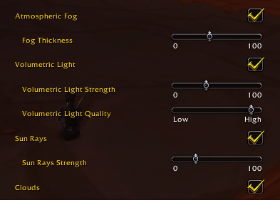

# comfyatmosphere

> **Bugs, questions and screenshots. Ty for testing!: [join our Discord](https://discord.gg/YSWzYk8xP).**
>
> [](https://discord.gg/YSWzYk8xP)

Atmosphere for the World of Warcraft 1.12 client: thicker fog, sun rays, and volumetric light through the trees. It is
one DLL and one ini file, `comfyfog.dll` and `comfyfog.ini`. The names come from the first version, which only
did fog.

Looking for fog on 3.3.5a? [coa-vfog](https://github.com/jealous-sound/coa-vfog) does volumetric fog and light
shafts for the Ascension (CoA) 3.3.5a client.

[](media/comfyatmosphere.mp4)

*Click the preview for the full video.*

It loads like comfygrass (moving grass for the same client): VanillaFixes loads the DLL, and the DLL patches
the Direct3D 9 device of DXVK's `d3d9.dll`.

## Features

| | What it does | Default |
| --- | --- | --- |
| **Fog** | One `thickness` dial from 0 to 100: haze near the camera, increasing gently with distance. Trees and characters get the same fog as the terrain. | on |
| **Sun rays** | Rays of light from the sun, through gaps in the trees and around buildings. Lit clouds do not cast rays. Cheap. | on |
| **Volumetric light** | Fog is lit where sunlight reaches it and dark where leaves and walls shade it. It stays fixed in the world when the camera moves. Needs `[depth]` and `[shadow]`. | off |
| **Clouds** | `[sky] clouds = 0` hides the cloud layer. | shown |

All settings are in `comfyfog.ini`. **F11 reloads it in game.**

## In-game controls

The addon in [`addon/ComfyAtmosphere`](addon/ComfyAtmosphere) adds these controls to **Video > Shaders** in the
game's options:



| Control | Setting in `comfyfog.ini` |
| --- | --- |
| Atmospheric Fog, Fog Thickness | `[fog] enabled`, `thickness` |
| Volumetric Light, Volumetric Light Strength | `[volume] enabled`, `strength` |
| Volumetric Light Quality (Low, Medium, High) | `[volume] quality` |
| Sun Rays, Sun Rays Strength | `[rays] enabled`, `strength` |
| Clouds | `[sky] clouds` |

A change shows in the world while you move the slider. **Cancel** puts the old values back. **Defaults** puts
the values from `comfyfog.ini` back.

- A control you move wins over `comfyfog.ini`, also after F11.
- The **Volumetric Light** box also turns on `[depth]` and `[shadow]`, which the light needs.
- **Volumetric Light Quality** at High uses the values in `comfyfog.ini`. Medium and Low replace four of
  them with cheaper values: a smaller shadow map, fewer samples, a lower resolution for the light, and a
  shadow map that is drawn less often. If the frame rate drops with the light on, set it lower.
- The addon needs `comfyfog.dll`. Without the DLL, it adds no controls.
- The other settings stay in `comfyfog.ini` only.

The addon needs the Turtle WoW options window, which builds its pages from a table the addon can add to.

## Keys

| Key | |
| --- | --- |
| F11 | Reload `comfyfog.ini` |
| Shift+F11 | Fog on / off (to compare) |
| Ctrl+F11 | Sun rays on / off |
| Alt+F11 | Volumetric light on / off |
| F12 | Log one frame of diagnostics to `comfyfog.log` |
| Alt+F12 | Run the benchmark (below) |

## Benchmark

Alt+F12 measures what each feature costs on your computer. It takes 40 seconds.

1. Turn on the volumetric light and play for a minute, so its shadow cache fills as in normal play.
2. Go outside in daylight. Stand still and face the sun.
3. Press Alt+F12. Do not move the mouse until it is done.
4. Open `comfyfog.log` in the client folder. The table is on the lines that start with `bench:`.

It runs four steps: fog + rays + volumetric light, fog + rays, fog, and nothing. For each step the table
gives:

- **fps** and **ms/frame**: the frame rate.
- **slowest 1%**: the time of the slowest frames, in milliseconds. Stutter shows here.
- **our GPU ms** and **our CPU ms**: the time of our own passes in each frame.

Below the table, one line splits the light into its parts: the shadow map and the light passes on the GPU,
and on the CPU the recording of the game's draws, the shadow cache and its replay.

Keep the game in front while it runs: in the background the client caps its frame rate. Under any cap (vsync,
a frame limiter, the background cap) the frame rate stays the same in every step, and the GPU slows its clocks,
so its times read too high. The CPU column still shows the cost. Turn the cap off for a benchmark.

After the run, the settings go back as they were. F11 stops the run.

## Install

Download the zip from [Releases](https://github.com/aloofbit/comfyatmosphere/releases), or build it (below).

1. Copy `comfyfog.dll` and `comfyfog.ini` to the client folder, next to `WoW.exe` and `d3d9.dll`.
2. Add the line `comfyfog.dll` to `dlls.txt`. If you use comfygrass, put it **after** `comfygrass.dll`.
   comfyfog chains on top of comfygrass, so the grass gets the new fog.
3. For the in-game controls, copy the folder `addon/ComfyAtmosphere` to `Interface\AddOns`.
4. Start the game with `VanillaFixes.exe`.

To turn on volumetric light, set `enabled = 1` under `[depth]`, `[shadow]` and `[volume]` in the ini, or tick
**Volumetric Light** in Video > Shaders.

## Build

Visual Studio 2022 and CMake. **32-bit only**: the 1.12 client is x86.

```
cmake -B build -A Win32
cmake --build build --config Release
```

`comfyfog.dll` is written to the project root, next to `comfyfog.ini`.

## Caveats

- **Made for one client build.** The volumetric light uses camera and player addresses from one `WoW.exe`.
  Another build moves them. The ini exposes them.
- **Volumetric light** draws the world's solid geometry again from the sun, every third frame by default. It
  is the most expensive feature. If the frame rate drops, lower **Volumetric Light Quality** or turn the light
  off with Alt+F11. To see what it costs, run the benchmark (Alt+F12).

[NOTES.md](NOTES.md) explains how it works, what was measured in the client, and what did not work.

## Time of day

Time of day is a separate DLL: [comfytime](https://github.com/aloofbit/comfytime). Use it to test the light
at noon, or to keep the sun where you want it. The volumetric light follows the sun in the sky, so it moves
with the time comfytime sets.

## Licence

GPL-3.0. See [LICENSE](LICENSE).
