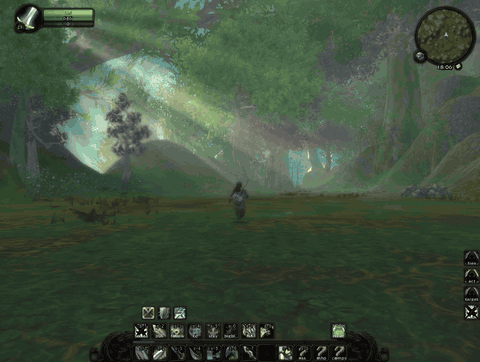
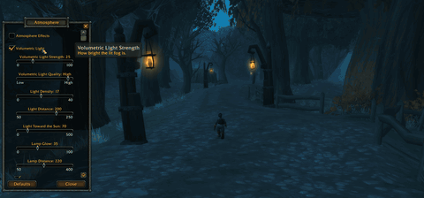
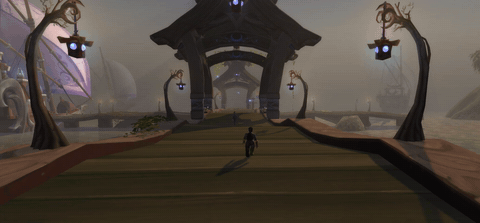
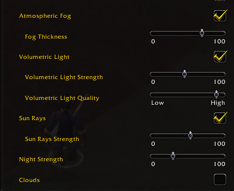

# comfyatmosphere

> **Bugs, questions and screenshots. Ty for testing!: [join our Discord](https://discord.gg/YSWzYk8xP).**
>
> [](https://discord.gg/YSWzYk8xP)

Atmosphere for the World of Warcraft 1.12 client: volumetric fog, sun shadows, volumetric light through the
trees, sun rays, glowing lamps and darker nights. It is one DLL and one ini file, `comfyfog.dll` and `comfyfog.ini`. The names
come from the first version, which only did fog.

> **❄ Looking for fog on 3.3.5a? ❄** [coa-vfog](https://github.com/jealous-sound/coa-vfog) does volumetric fog and light shafts for the Ascension (CoA) 3.3.5a client.

[](media/comfyatmosphere.mp4)

*Click the preview for the full video.*

It loads like comfygrass (moving grass for the same client): VanillaFixes loads the DLL, and the DLL patches
the Direct3D 9 device of DXVK's `d3d9.dll`.

## Contents

- [Features](#features)
- [Compatibility](#compatibility)
- [Install](#install)
- [In-game controls](#in-game-controls)
  - [/atmos](#atmos)
  - [Finding faults](#finding-faults)
- [Keys](#keys)
- [Benchmark](#benchmark)
- [Build](#build)
- [Caveats](#caveats)
- [Time of day](#time-of-day)
- [Licence](#licence)

## Features

| | What it does | Default |
| --- | --- | --- |
| **Volumetric light** | The air is lit where sunlight reaches it and dark where leaves and walls shade it. It stays fixed in the world when the camera moves. | on |
| **Sun shadows** | Terrain, buildings, trees, players and creatures cast shadows from the sun. Shade takes the sky's cool colour and sunlit ground a warm one. The shadows of the world are drawn from the game's map files, so they are there before you walk past. Needs the volumetric light. | on |
| **Sun rays** | Rays of light from the sun, through gaps in the trees and around buildings. The rays come from the sun only, and fade when a mountain or a wall covers it. Cheap. | on |
| **Lamps** | Lampposts, lanterns, candles, torches and fireplaces glow in the air and light the walls and ground near them. The lights inside buildings are read from the map files, with the colour of each flame. Needs the volumetric light. | on |
| **Night** | Nights are darker. Lamps still light the ground near them, and buildings stay as the game lights them. Night comes from the game clock. The rays and the light at night follow the moons. | on |
| **Fog** | Volumetric fog that lies on the ground and thins upward. It collects in valleys and over water, is thicker at dawn, and drifts in patches with the wind. The sun lights it, and the sky lights it in the zone's own fog colour. With the volumetric light on, it shows shafts where trees and walls shade the sun; without it, it costs much less. The game's own fog stays as the far wall. | on |
| **Clouds** | `[sky] clouds = 0` hides the cloud layer. | hidden |

All settings are in `comfyfog.ini`. **F11 reloads it in game.**

[](media/lamps-night.mp4)

*Lamps and night in Duskwood: the effects off, then on.*

[](media/harbour-shadows.mp4)

*Sun shadows and lanterns on a harbour walkway.*

## Compatibility

Tested on a fresh OctoWoW client with no other mods:

| | Tested with |
| --- | --- |
| Client | `WoW.exe` 1.12.1 (build 5875), 4812 KB, hash `c1d1205e0a984ca4` |
| Launcher | VanillaFixes, with only `comfyfog.dll` in `dlls.txt` |
| DXVK | v2.7.1-1-gplasync, the `d3d9.dll` that comes with the client |
| Data | 18 MPQs: the base archives, `patch.MPQ` and `patch-1` to `patch-5` |
| Addons | ComfyAtmosphere and the client's Blizzard addons |
| System | Windows 10 (build 19045), NVIDIA GeForce RTX 2080 Super, driver 576.28 |

`/atmos probe` (or F12) writes a report of your client into `comfyfog.log`, under `client report`: the same
parts, with a hash of each file and every DLL loaded. Compare it with this table.

## Install

Download the zip from [Releases](https://github.com/aloofbit/comfyatmosphere/releases), or build it (below).

1. Copy `comfyfog.dll` and `comfyfog.ini` to the client folder, next to `WoW.exe` and `d3d9.dll`.
2. Add the line `comfyfog.dll` to `dlls.txt`. If you use comfygrass, put it **after** `comfygrass.dll`.
3. For the in-game controls, copy the folder `addon/ComfyAtmosphere` to `Interface\AddOns`.
4. Start the game with `VanillaFixes.exe`.

## In-game controls

The addon in [`addon/ComfyAtmosphere`](addon/ComfyAtmosphere) adds a page of controls to the game's options:
**Video > Atmosphere**, below Shaders. **`/atmos options`** opens the same controls in a small window of their
own. Use the window on a client whose options window has no page for them.



| Control | Setting in `comfyfog.ini` |
| --- | --- |
| Atmosphere Effects | `[general] enabled`: every effect at once |
| Volumetric Light, Volumetric Light Strength | `[volume] enabled`, `strength` |
| Volumetric Light Quality (Low, Medium, High) | `[volume] quality` |
| Light Density (thousandths), Light Distance (yards), Light Toward the Sun (thousandths) | `[volume] density`, `maxDistance`, `anisotropy` |
| Lamps, Lamp Glow, Lamp Distance (%) | `[lamps] enabled`, `strength`, `fogReach` |
| Lantern Light, Torch Light, Indoor Lamps, Lamps by Day (%) | `[lamps] lanternLight`, `torchLight`, `indoors`, `day` |
| Sun Shadows | `[sunshadows] enabled` |
| World / Object Shadows, Player / Creature Shadows | `[sunshadows] world`, `units` |
| Lock Shadow Angle, Shadow Angle (degrees) | `[sunshadows] lock`, `lockTilt` |
| Sun Shadow Strength | `[sunshadows] strength` |
| Night Shadows (%) | `[sunshadows] night` |
| Character Shadow Strength | `[sunshadows] unitStrength` |
| Character Backside Shadow | `[sunshadows] bodyShade` |
| Sun Smoothing (seconds) | `[sun] glide` |
| Sunlight, Shade Colour, Sunlight Warmth (%) | `[sunshadows] sunlight`, `shadeTint`, `sunTint` |
| Shadow Resolution (1024, 2048, 4096) | `[shadow] size` |
| Shadow Softness | `[sunshadows] softness` |
| Shadow Redraw | `[shadow] mapEvery` |
| Sun Rays, Sun Rays Strength | `[rays] enabled`, `strength` |
| Sun Rays Softness, Sun Rays Smoothing | `[rays] soften`, `smooth` (in percent) |
| Night Strength | `[night] strength` |
| Night Darkness, Moonlight Colour (%) | `[night] darkness`, `tint` |
| Clouds | `[sky] clouds` |
| Debug View | the `debug` values of each effect; 0 leaves them to the ini |
| Fog | `[fog] enabled` |
| Fog Density, Fog Height (yards) | `[fog] density` (ten-thousandths of a yard: 25 = 0.0025), `height` |
| Fog Reach, Fog on Sky (yards) | `[fog] reach`, `skyDistance` |
| Fog Brightness (%), Fog Sunlight | `[fog] brightness`, `sunLight` (in tenths) |
| Fog Patchiness (%), Wind Speed, Wind Direction | `[fog] patchiness`, `windSpeed` (tenths of a yard a second), `windDeg` |
| Low Ground Mist, Water Mist, Morning Mist, Lamps in Mist (%) | `[fog] lowGround`, `water`, `morning`, `lampMist` |

A change shows in the world while you move the slider. **Cancel** puts the old values back. **Defaults** puts
the values from `comfyfog.ini` back.

- A control you move wins over `comfyfog.ini`, also after F11.
- The **Volumetric Light** box also turns on `[depth]` and `[shadow]`, which the light needs.
- **Sun Shadows** use the volumetric light's shadow map, so they need Volumetric Light on. While both are
  on, the game's round shadow under each character is off (the CVar `shadowLOD`). At logout it is set
  back, so it returns if the mod is removed.
- **Fog** works with Volumetric Light on or off. With the light on, it shows shafts where trees and walls
  shade the sun. With the light off, the sun lights all of it, and the shadow map is not drawn, which
  gives back most of the light's cost. It lies on the ground from the map files (`[shadow] mapTerrain`).
  **Fog Reach** sets how far it gathers: lower lets you see further across open land and the sea. **Fog on Sky** sets how much it covers the sky; 0 leaves the horizon clear.
- **Night Darkness** makes the world darker at night, and **Moonlight Colour** makes the night bluer. They
  need Volumetric Light on. Inside buildings they do nothing.
- **Night Strength** sets the sun rays and the volumetric light at night. 100 is the day strength. 0 turns
  both off at night. **Night Shadows** sets the shadows at night in the same way. The change to night
  starts at 20:00 and the change to day at 05:00. Each takes 1.5 hours. Set other hours with `[night] dusk`,
  `dawn` and `fade`. For rays from the larger moon only, set `[rays] secondMoon = 0`.
- **Character Shadow Strength** makes the shadows of players and creatures darker than the world's
  shadows. They then show inside the shade of a building too.
- **Character Backside Shadow** sets how dark the shade is on the body of a player or creature, on its side
  away from the sun. 100 is the darkest. At 0 the body keeps only the game's own lighting. The shadow it
  casts does not change.
- **Volumetric Light Quality** at High uses the values in `comfyfog.ini`. Medium and Low replace two of
  them with cheaper values: fewer samples and a lower resolution for the light. If the frame rate drops
  with the light on, set it lower, or set Shadow Resolution lower or Shadow Redraw higher.
- The addon needs `comfyfog.dll`. Without the DLL, it adds no controls.
- The other settings stay in `comfyfog.ini`. Set them in game with `/atmos` (below).

The Atmosphere page needs the Turtle WoW options window, which builds its pages from a table the addon can
add to. On another client, use `/atmos options`.

### /atmos

`/atmos` reads and sets any value in `comfyfog.ini` from the game's chat. A change shows at once.

| Command | |
| --- | --- |
| `/atmos` | The commands and the sections |
| `/atmos options` | Open or close the settings window |
| `/atmos debug` | Open or close the debug panel (below) |
| `/atmos stats` | Show or hide the stats panel (below) |
| `/atmos probe` | Log one frame to `comfyfog.log`, as F12 does |
| `/atmos bench` | Run the benchmark, as Alt+F12 does |
| `/atmos <section>` | Every value in a section |
| `/atmos <section>.<key>` | One value, and where it came from |
| `/atmos <section>.<key> <value>` | Set it. The key alone will do when no other section has it |
| `/atmos list` | The values set with `/atmos` |
| `/atmos reset` | Drop them. `comfyfog.ini` applies again |
| `/atmos save` | Write them into `comfyfog.ini`. The comment on each line stays |

A value set with `/atmos` stays until `reset` or `save`, also after F11. A value that a control on the
Atmosphere page sets is refused: use the control.

### Finding faults

The **Debug** button in the settings window, or `/atmos debug`, opens the debug panel:

- **Probe** logs one frame to `comfyfog.log`, and a report of your client: the comfyfog version, WoW.exe, the
  DLLs loaded, DXVK, the MPQs, the addons and the settings. The chat says when it is taken.
- **Stats** shows a panel of figures, once a second: your position, the frame rate, the shadow casters held
  and what was added and dropped near you, and the fog.
- **Benchmark** runs the benchmark (below). The chat says when it starts and ends.
- **Trace**: the next probe also logs 180 frames. The game runs slowly meanwhile.
- **Debug view** `<` `>` shows one stage of an effect instead of the game.

Probe, the stats and the debug panel can be put on keys: **Key Bindings > ComfyAtmosphere**. A screenshot with
the stats on screen, and a probe at the same moment, is the best report of a fault. Send `comfyfog.log` with it.
The log has no account name, and your user folder shows as `%USERPROFILE%`.

## Keys

| Key | |
| --- | --- |
| F11 | Reload `comfyfog.ini` |
| Ctrl+F11 | Sun rays on / off |
| Alt+F11 | Volumetric light on / off |
| F12 | Log one frame of diagnostics to `comfyfog.log` |
| Alt+F12 | Run the benchmark (below) |

## Benchmark

Alt+F12, or `/atmos bench`, measures what each feature costs on your computer. It takes 30 seconds.

1. Turn on the volumetric light and play for a minute, so its shadow cache fills as in normal play.
2. Go outside in daylight. Stand still and face the sun.
3. Press Alt+F12. Do not move the mouse until the chat says it is done.
4. Open `comfyfog.log` in the client folder. The table is on the lines that start with `bench:`.

It runs three steps: rays + volumetric light (with the fog), rays, and nothing. For each step the table
gives:

- **fps** and **ms/frame**: the frame rate.
- **slowest 1%**: the time of the slowest frames, in milliseconds. Stutter shows here.
- **our GPU ms** and **our CPU ms**: the time of our own passes in each frame.

Below the table, one line splits the light into its parts: the shadow map and the light passes on the GPU,
and on the CPU the recording of the game's draws, the shadow cache and its replay.

Keep the game in front while it runs: in the background the client caps its frame rate. Under any cap (vsync,
a frame limiter, the background cap) the frame rate stays the same in every step, and the GPU slows its clocks,
so its times read too high. The CPU column still shows the cost. Turn the cap off for a benchmark.

After the run, the settings go back as they were. F11 stops the run.

## Build

Visual Studio 2022 and CMake. **32-bit only**: the 1.12 client is x86.

```
cmake -B build -A Win32
cmake --build build --config Release
```

`comfyfog.dll` is written to the project root, next to `comfyfog.ini`.

## Caveats

- **Made for one client build.** The volumetric light uses camera and player addresses from one `WoW.exe`,
  Night Strength uses the address of the game clock, and the shadows use the address of the map name.
  Another build moves them. The ini exposes them.
- **Volumetric light** draws the world again from the sun for the shadows. It is the most expensive feature.
  If the frame rate drops, lower **Volumetric Light Quality** or **Shadow Resolution**, raise **Shadow
  Redraw**, or turn the light off with Alt+F11. To see what it costs, run the benchmark (Alt+F12).

[NOTES.md](NOTES.md) explains how it works, what was measured in the client, and what did not work.

## Time of day

Time of day is a separate DLL: [comfytime](https://github.com/aloofbit/comfytime). Use it to test the light
at noon, or to keep the sun where you want it. The volumetric light follows the sun in the sky, so it moves
with the time comfytime sets.

## Licence

GPL-3.0. See [LICENSE](LICENSE).
