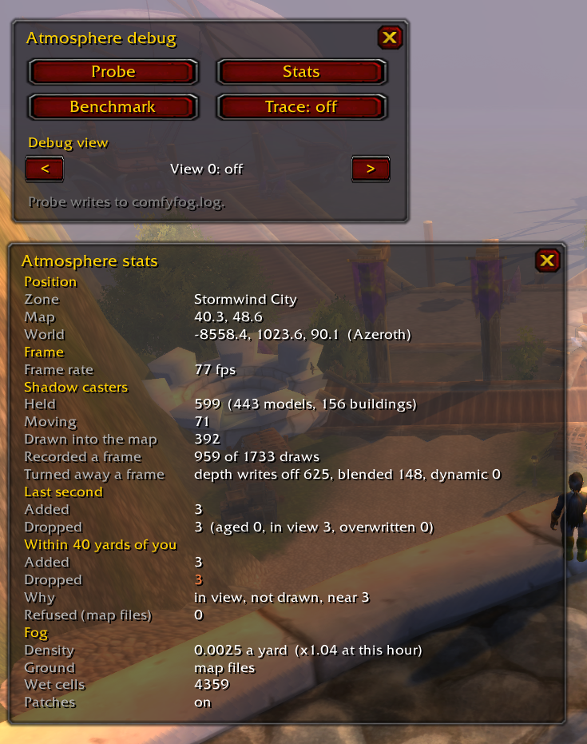

# Comfy Atmosphere

> **Bugs, questions and screenshots. Ty for testing!: [join our Discord](https://discord.gg/uhefX2efB7).**
>
> [](https://discord.gg/uhefX2efB7)


Atmosphere mod the World of Warcraft 1.12 client. Volumetric lighting, fog, shadows, sun rays, water, and more.

https://github.com/user-attachments/assets/67551de4-3ee5-4ea1-83ed-b72592bfce1d

## Testing and Benchmarks

When bugs are reported we implement automation testing to reduce regression.

[](https://aloofbit.github.io/comfyatmosphere/latest/)

## Roadmap

*Now*: Testing and implementing repairs until each effect is cohesive with the game. Thank you for help testing!


## Features
- Volumetric Light
- Realtime shadows
- Sun rays
- Fog
- Lamps (From 16 to 256)
- Night Config
- Moving Grass
- Settings Addon for it all

[](media/lamps-night.mp4)

*Lamps and night in Duskwood: the effects off, then on.*

[](media/harbour-shadows.mp4)

*Sun shadows and lanterns on a harbour walkway.*

## Compatibility

Tested on a fresh OctoWoW client with no other mods:

| | Tested with |
| --- | --- |
| Client | `WoW.exe` 1.12.1 (build 5875), 4812 KB, hash `c1d1205e0a984ca4` |
| Launcher | VanillaFixes, with only `comfyatmos.dll` in `dlls.txt` |
| DXVK | v2.7.1-1-gplasync, the `d3d9.dll` that comes with the client |
| Data | 18 MPQs: the base archives, `patch.MPQ` and `patch-1` to `patch-5` |
| Addons | ComfyAtmosphere and the client's Blizzard addons |
| System | Windows 10 (build 19045), NVIDIA GeForce RTX 2080 Super, driver 576.28 |

`/atmos probe` (or F12) writes a report of your client into `Logs\comfyatmos.log`, under `client report`: the same
parts, with a hash of each file and every DLL loaded. Compare it with this table.

## Install

Download the zip from [Releases](https://github.com/aloofbit/comfyatmosphere/releases), or build it (below).

1. Copy `comfyatmos.dll` and `comfyatmos.ini` to the client folder.
2. Add the line `comfyatmos.dll` to `dlls.txt`. ⚠️remove comfyfog/comfygrass if you have them
3. Copy the folder `addon/ComfyAtmosphere` to `Interface\AddOns`.
4. Start the game with `VanillaFixes.exe`.

## Config

Use `/atmos options` in game to enable/disable and tune features of the mod.


## In-game controls `/atmos`

`/atmos` reads and sets any value in `comfyatmos.ini` from the game's chat. A change shows at once.

| Command | |
| --- | --- |
| `/atmos` | The commands and the sections |
| `/atmos options` | Open or close the settings window |
| `/atmos debug` | Open or close the debug panel (below) |
| `/atmos stats` | Show or hide the stats panel (below) |
| `/atmos probe` | Log one frame to `Logs\comfyatmos.log`, as F12 does |
| `/atmos bench` | Run the benchmark, as Alt+F12 does |
| `/atmos framelog [seconds]` | Time every frame for that long (10), then log the slowest frames and our share of each |
| `/atmos <section>` | Every value in a section |
| `/atmos <section>.<key>` | One value, and where it came from |
| `/atmos <section>.<key> <value>` | Set it. The key alone will do when no other section has it |
| `/atmos list` | The values set with `/atmos` |
| `/atmos reset` | Drop them. `comfyatmos.ini` applies again |
| `/atmos save` | Write them into `comfyatmos.ini`. The comment on each line stays |

A value set with `/atmos` stays until `reset` or `save`, also after F11. A value that a control on the
Atmosphere page sets is refused: use the control.

### Debugging Help

The **Debug** button in the settings window, or `/atmos debug`, opens the debug panel:



## Keys

| Key | |
| --- | --- |
| F11 | Reload `comfyatmos.ini` |
| Ctrl+F11 | Sun rays on / off |
| Alt+F11 | Volumetric light on / off |
| F12 | Log one frame of diagnostics to `Logs\comfyatmos.log` |
| Alt+F12 | Run the benchmark (below) |

## Benchmark

Alt+F12, or `/atmos bench`, measures what each feature costs on your computer. It takes 40 seconds. Writes results to the chat and to `Logs\comfyatmos.log`

## Build

Visual Studio 2022 and CMake. **32-bit only**: the 1.12 client is x86.

```
cmake -B build -A Win32
cmake --build build --config Release
```

`comfyatmos.dll` is written to the project root, next to `comfyatmos.ini`.

## Licence

GPL-3.0. See [LICENSE](LICENSE).
